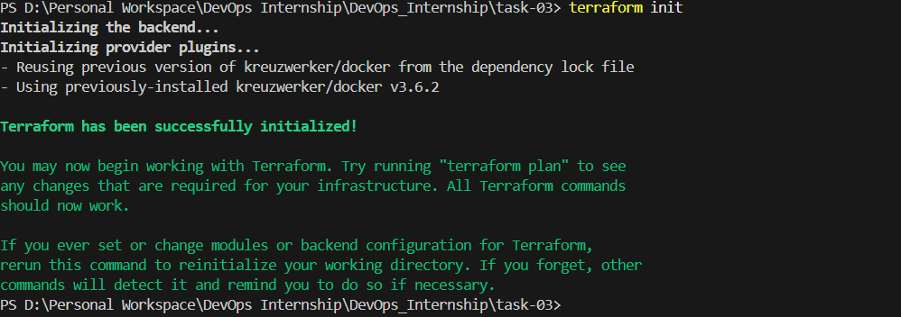

# Task-03: Infrastructure as Code (IaC) using Terraform

## Objective
Provision a local Docker container using Terraform to understand Infrastructure as Code (IaC) concepts.

---

## Tools Used
- Terraform
- Docker

---

## Project Overview
This task uses the Docker provider in Terraform to:

- Pull an Nginx Docker image
- Create a Docker container
- Expose the container on a local port
- Manage infrastructure lifecycle using Terraform commands

---

## Terraform Workflow

### 1. Initialize Terraform
```bash
terraform init
Downloads required providers and initializes the working directory.

2. Review Execution Plan
terraform plan
Shows what Terraform will create before applying changes.

3. Provision Infrastructure
terraform apply
Creates:

Docker image (nginx:latest)

Docker container (terraform-nginx)

4. Check Running Container
docker ps
Access in browser:

http://localhost:8081
5. Check Terraform State
terraform state list
Displays resources managed by Terraform.

6. Destroy Infrastructure
terraform destroy
Removes all resources created by Terraform.

Files Included
main.tf — Terraform configuration file

README.md — Task documentation

Outcome
Learned how to provision infrastructure using Terraform.

Understood Terraform lifecycle:

init

plan

apply

state

destroy

Automated Docker container creation using Infrastructure as Code.


